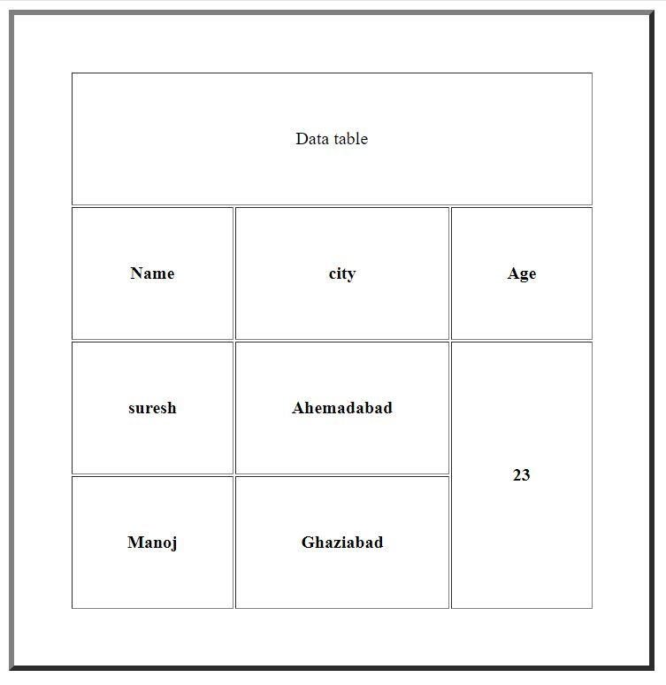
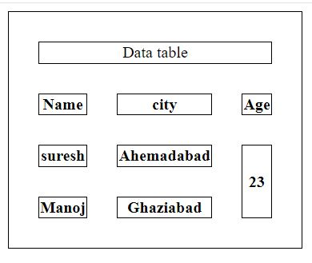
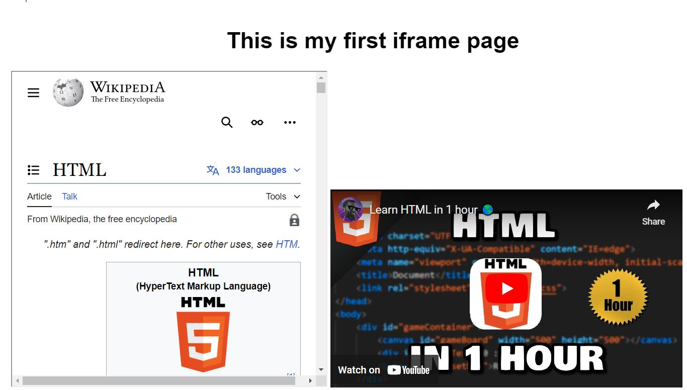

# Assignment 1: WD-HTML
**Q-1**:Are the HTML tags and elements the same thing?

**Ans**: No, HTML tags and elements are not the same thing.  HTML tags are the part of Element. 
     HTML tags is used to give the structure to the document. there is two types of tags (1)opening tag (2)closing tag. 
     E.g.```<p>,<i>,<b>```.
     HTML element includes opening tag, closing tag and content between tags.
     Example:``` <P> This is paragraph </p>```

**Q-2**:What are tags and attributes in HTML?

**Ans**:HTML tags is used to give the structure to the document. there is two types of tags (1)opening tag (2)closing tag. 
E.g.```<p>,<i>,<b>```.
HTML attributes are used to control the element behaviour,used to add additional information about element like behaviour and display of element.Attributes are always added in the starting tag. 
E.g. src, href, class, etc.

**Q-3**:What are Void elements?

**Ans**:The element which has only starting tag is called void element. It does not have any closing tag. So, it is also called Self-closing tags. E.g. ```<br>, <hr>, <input>, ```, etc.

**Q-4**:What are HTML entities?

**Ans**:HTML entities is a piece of text("string") which starts with ampersand(&) sign and ends with semicolon. HTML entities are uesd to show or display some unseen or reserved characters for e.g. &copy; , &reg; , &euro;
Examples: ``` &copy; , &reg; , &euro; ```.

**Q-5**:What are different types of lists in HTML?

**Ans**:There are two types of tlists in HTML (1)**Unordered list**(2)**Ordered list**
(1)**Unordered list**: The list in which order does not matter or the list which do not have any particular sequence is called unordered list. It is dislayed with bullet points. It's syntax is ```<ul>```.
E.g.
```
<ul>
  <li>Rajkot</li>
  <li>Baroda</li>
  <li>Ahemedabad</li>
</ul>
```
Output:
<ul>
  <li>Rajkot</li>
  <li>Baroda</li>
  <li>Ahemedabad</li>
</ul>

(2)**Ordered list**: The list in which order matters and the items do have a particular sequence is called ordered list. It is diplayed with numbers or letters. It's syntax is```<ol>```.
E.g.
```
<ol>
  <li>Bowl</li>
  <li>Water</li>
  <li>Maggi</li>
</ol>
```
Output:
<ol>
  <li>Bowl</li>
  <li>Water</li>
  <li>Maggi</li>
</ol>

**Q-6**:What is the 'class'attribute in HTML?

**Ans**:Class attribute is used to select and access specific elements. It specifies one or more class names for an element.
E.g.
```
<div class="city">
  <h2>Delhi</h2>
  <p>Delhi is the capital of India.</p>
</div>
```
Output:
Delhi
Delhi is the capital of India.

**Q-7**:What is the difference vetween the 'id' attribute and the 'class' attrribute of HTML elements?

**Ans**:Difference between the 'id' attribute and 'class' attribute is that 'id' attribute must be used by only one HTML element and is unique and 'class' attribute can be used by multiple HTML elements.

**Q-8**:What are the various formatting tags in HTML?

**Ans**:Formatting tags are ```<b>, <i>, <strong>, <em>, <small>, <mark>, <del>, <sub>, <sup>, <abbr>, <code>, <q>, <blockquote>, <address>, etc.```
E.g.
```<b>This text is bold</b>```- 
<b>This text is bold</b>

```<i>This text is italic</i>```- 
<i>This text is italic</i>

```<small>This is some smaller text.</small>```- 
<small>This is some smaller text.</small>

```<p>This is the <mark>mark</mark> tag.</p>```- 
<p>This is the <mark>mark</mark> tag.</p>

```<p>My favorite color is <del>blue</del> red.</p>```-
<p>My favorite color is <del>blue</del> red.</p> 
etc.

**Q-9**:How is Cell padding is different from Cell spacing?

**Ans**:Cell padding is used to give space between the border of the table cell and its content. It is mainly meant for one cell.
Cell spacing is used to give space between the two cells of the table. It is subjected to more than one cell.
Examples: (1)cell padding:
```
<!DOCTYPE html>
<html lang="en">
<head>
    <meta charset="UTF-8">
    <meta name="viewport" content="width=device-width, initial-scale=1.0">
    <title>Document</title>
    <style>
        table, th, td {
          padding: 50px;
        }
        
        </style>
</head>
<body>
    <table border="5">
        <tr>
        <td colspan="3" align="center">Data table</td>
        </tr>
        <tr>
             <th>Name</th>
             <th>city</th>
             <th>Age</th>
        </tr>
        <tr>
             <th>suresh</th>
             <th>Ahemadabad</th>
             <th rowspan="2">23</th>
        </tr>
        <tr>
             <th>Manoj</th>
             <th>Ghaziabad</th>
        </tr>
   </table>   
</body>
</html>
```

Output:
 

(2) cell spacing:
```
<!DOCTYPE html>
<html lang="en">
<head>
    <meta charset="UTF-8">
    <meta name="viewport" content="width=device-width, initial-scale=1.0">
    <title>Document</title>
    <style>
        table, th, td {
          border: 1px solid black;
        }
        table {
          border-spacing: 30px;
        }
        </style>
</head>
<body>
    <table border="5">
        <tr>
        <td colspan="3" align="center">Data table</td>
        </tr>
        <tr>
             <th>Name</th>
             <th>city</th>
             <th>Age</th>
        </tr>
        <tr>
             <th>suresh</th>
             <th>Ahemadabad</th>
             <th rowspan="2">23</th>
        </tr>
        <tr>
             <th>Manoj</th>
             <th>Ghaziabad</th>
        </tr>
   </table>   
</body>
</html>
```
Output:



**Q-10**:How can we club two or more rows or columns into a single row or column in an HTML table.

**Ans**:we can club two rows by using ```<rowspan>``` attribute and to club two column we use ```<colspan>``` attribute.
E.g.
```
<table>
     <tr>
     <td colspan="3" align="center">Data table</td>
     </tr>
     <tr>
          <th>Name</th>
          <th>city</th>
          <th>Age</th>
     </tr>
     <tr>
          <th>suresh</th>
          <th>Ahemadabad</th>
          <th rowspan="2">23</th>
     </tr>
     <tr>
          <th>Manoj</th>
          <th>Ghaziabad</th>
     </tr>
</table>
```


Output:

<table>
     <tr>
     <td colspan="3" align="center">Data table</td>
     </tr>
     <tr>
          <th>Name</th>
          <th>city</th>
          <th>Age</th>
     </tr>
     <tr>
          <th>suresh</th>
          <th>Ahemadabad</th>
          <th rowspan="2">23</th>
     </tr>
     <tr>
          <th>Manoj</th>
          <th>Ghaziabad</th>
     </tr>
</table>

**Q-11**:what is the difference between block-level element and inline element?

**Ans**:
 | Block level Element | Inline Element |
| ----------- | ----------- |
| Block elements cover space from left to right as far as it can go. | Inline elements only covers the space bounded by the tags of the element. |
| It always starts from the new line. | It never starts from the new line. |
|E.g. ```<h1>, <div>, <hr>, <table>, <article>, <form> etc.```| E.g. ```<p>, <i>, <b>, <a>, <span>, , <input>, etc.```|

**Q-12**:How to create a Hyperlink in HTML?

**Ans**:A basic link can be created by putting content inside the ```<a>```anchor tag using the 'href' attribute known as hypertext reference.
E.g. 
```
<p>
  I'm creating a link to
  <a href="https://www.google.co.in/">the google homepage</a>.
</p>
```
Output;
<p>
  I'm creating a link to
  <a href="https://www.google.co.in/">the google homepage</a>.
</p>

**Q-13**:What is the use of an iframe tag?

**Ans**:'iframe' tag is used to embedd another HTML page into current HTML document. It is used to load content from another site to our current page. It is used to embedd youtube videos and Google map contents.

Example:
```
<!DOCTYPE html>
<html lang="en">
  <head>
    <meta charset="UTF-8" />
    <meta name="viewport" content="width=device-width, initial-scale=1.0" />
    <title>iframe program</title>
  </head>
  <body>
    <h1 style="text-align: center;">This is my first iframe page</h1>
    <iframe
      src="https://en.wikipedia.org/wiki/HTML"
      frameborder="1"
      height="500px"
      width="500px"
      
    ></iframe>
    <iframe
      src="https://www.google.com/maps/embed?pb=!1m18!1m12!1m3!1d59028.95731058957!2d71.01464627552386!3d22.37967437234408!2m3!1f0!2f0!3f0!3m2!1i1024!2i768!4f13.1!3m3!1m2!1s0x3959af201c8cab21%3A0xfe502e85ec1be5d3!2sRajkot%20(Hirasar)%20International%20Airport!5e0!3m2!1sen!2sin!4v1717385540929!5m2!1sen!2sin"
      width="600"
      height="450"
      style="border: 1"
      allowfullscreen
      loading="lazy"
      referrerpolicy="no-referrer-when-downgrade"
      frameborder="1"
    ></iframe>
    <iframe
      width="560"
      height="315"
      src="https://www.youtube.com/embed/HD13eq_Pmp8?si=FqAeoXfQC3mqQsMb"
      title="YouTube video player"
      frameborder="0"
      allow="accelerometer; autoplay; clipboard-write; encrypted-media; gyroscope; picture-in-picture; web-share"
      referrerpolicy="strict-origin-when-cross-origin"
      allowfullscreen
      >
</iframe>
  </body>
</html>
```
output:




**Q-14**:What is the use of span tag? Explain with example?

**Ans**:```<span>```tag is used for inline grouping of the text or content of the document. It is also known as inline container. It is used to give markup, styling, color to the text or to the part of the text.
E.g.
```TGT is <span style="color: blue;"><b>The Grand Thakar</b></span>.The restaurant is near <span style="font-style: italic;">racecourse</span> road in rajkot city.```
Output:
TGT is <span style="color: blue;"><b>The Grand Thakar</b></span>.The restaurant is near <span style="font-style: italic;">racecourse</span> road in rajkot city. 

**Q-15**:How to insert a picture into a background image of a web page?

**Ans15**:
```
<html>
     <head>
          <title>BAckground image</title>
     </head>
     <body backgrounds="Images\Uttapam-recipe.jpg">
     </body>
</html>
```
**Q-16**:How are active links different from normal links?

**Ans**:**Normal link** means an unvisited link which appears blue color and underlined while in **Active links** if you give right or left click on the link whelter it is visited or unvisited it will appear red and the active link shows that browser is in process to load a new resource.

**Q-17**:What are the different tags to seperate sections of text?

**Ans**:```<p>, <br>, <hr>, <section>, <dl>, <dt>, <dd>.```

```<br>``` tag – It is used to separate the line of text. It breaks the current line and shifts the flow of the text to a new line.

```<p>``` tag–This tag is used to write a paragraph of text. As it is the paragraph tag so it always starts from new line.

```<hr>``` tag defines a thematic break in an HTML page. It is most often displayed as a horizontal rule that is used to separate content in an HTML page.

```<Section>``` tag defines the section of documents such as chapters, headers, footers, or any other sections. The section tag divides the content into sections and subsections. It is a semantic element.

```<dl>```tag is description list. It is enclodes by ```<dt>``` Description term and ```<dd>```Description data. ```<dl>``` displays element in definition form like dictionary.

**Q-18**:What is SVG?

**Ans**:SVG is Scalable Vector Graphics. It is Xml based markup language for describing 2D based vector graphics.
SVG images can be searched, indexed, scripted, compressed and created and edited with anyb text editor or drawing software.
SVG-vector format images can be rendered at any size without any loss of quality and can be localized by updating the text within them without the need of a graphical editor.

**Q-19**:What is the difference between HTML and XHTML?

**Ans**:
|HTML|XHTML|
|----|-----|
|HTML is hyper text markup language.|XHTML is Extensible markup language.|
|It is extended from SGML|It is extended from XML and HTML|
|All tags and attributes not necessary to be in lower or upper case|Every tag and attribute should be in lower case.|
|Doctype is not necessary to write at thwe top.|Doctype is necessary to write at the top of the file.|
|It is not necessary to close the tag in the orderthey are open.|It is necessary to close the tag in order they are open.|
|File extension should be .html or .htm|File extension should be .xhtml or .xht or .xml|

**Q-20**:What are logical and physical tags in HTML?

**Ans**:**(1)Physical tag:** It is used to provide visual appearance to the text.
Physical tags are used to indicate that how specific characters are to be formatted or indicated using HTML tags. 
Any physical style tag may contain any item allowed in text, including conventional text, images, line breaks, etc.
Physical Styles are rendered in the same manner by all browsers.
E.g. ```<sup>, <sub>, <i>, <big>, <small>, <u>, <tt>, <strike>, <b>, etc.``` 
**(2)Logical tag**:It is used to add some logical or semantic value to the text.
Logical tags are used to tell the browser what kind of text is written inside the tags. 
Logical tags are also known as Structural tags because they specify the structure of the document. 
Logical tags are used to indicate to the visually impaired person that there is something more important in the text or to emphasize the text.
It id used to display the abbreviation on the Web page.
It id used to display some famous quotation on our web page.
It is used to write some mathematical formula in terms of variables.
E.g. ```<strong>, <em>, <del>, <pre>, <blockquote>, <cite>, <code>, <abbr>, etc.```


